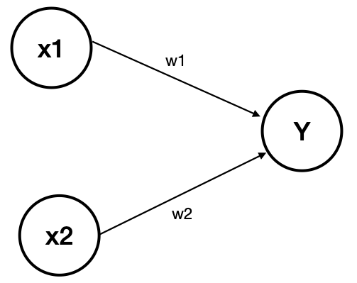

# Chapter02. 퍼셉트론

### 퍼셉트론이란?
다수의 신호를 입력 받아 하나의 신호로 출력하는 것

- x1, x2는 입력 신호, w1, w2는 가중치, y는 출력 신호
- 그림의 원을 노드 or 뉴런이라고 칭한다. (여기서는 노드라고 하겠음)

입력 신호가 노드에 보내질 때 각각 고유한 가중치와 곱해지게 된다.  
노드에서 보내준 신호의 총합이 한계를 넘어서게 되면 1을 출력하는데, 우리는 이 한계를 임계값이라 하며 기호는 $\theta$ 라고 한다.

수식으로 표현하면 다음과 같다.  
[식 2-1]
$$
\begin{cases}
0 (w_1x_1 + w_2x_2) \leq \theta \\
1 (w_1x_2 + w_2x_2) > \theta
\end{cases}
$$

### 단순한 논리 회로
논리 회로를 통해 퍼셉트론을 표현하고 싶다면, 자세한 코드는 [이 곳](./논리회로%20구현하기.py)으로 접속하세요. 
아래 논리 회로대로 작동하도록 하는 방법은 $w_1, w_2, \theta$의 값을 정해서 작동하도록 한다. 
**1. AND게이트**
| x1 | x2 | y |
|---|---|---|
| 0 | 0 | 0
| 1 | 0 | 0
| 0 | 1 | 0
| 1 | 1 | 1

**2. NAND게이트**
| x1 | x2 | y |
|---|---|---|
| 0 | 0 | 1
| 1 | 0 | 1
| 0 | 1 | 1
| 1 | 1 | 0

**3. OR게이트**
| x1 | x2 | y |
|---|---|---|
| 0 | 0 | 0
| 1 | 0 | 1
| 0 | 1 | 1
| 1 | 1 | 1

### 가중치와 편향 도입

