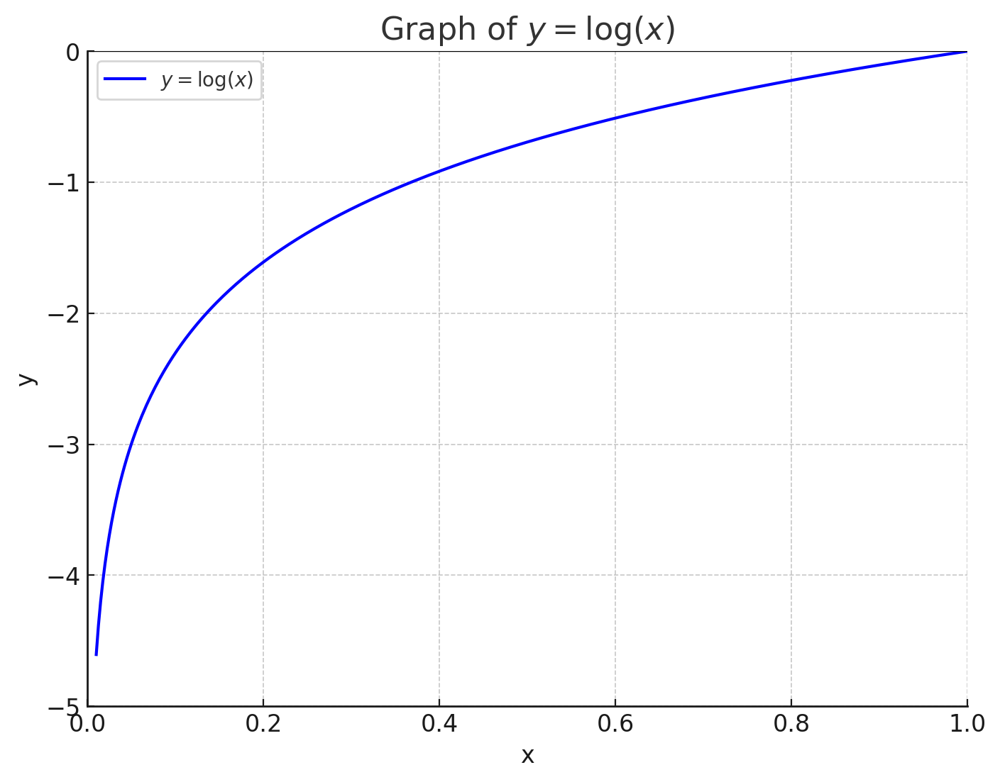

# Chapter04. 신경망 학습

### 신경망 학습이란?
신경망 학습은 가중치 매개변수의 최적값을 자동으로 획득하는 것이다.


### 손실함수
신경망의 성능의 나쁨을 나타내는 지표이다.
즉, 현재 모델의 성능 상태를 파악할 수 있는 하나의 지표가 된다. </br>
손실함수를 구하는 방법은 일반적으로 오차제곱합, 교차 엔트로피 오차가 있다.

### 오차제곱합
일반적으로 많이 사용하는 함수이다. </br>
수식은 다음과 같다.
$$
E = \frac{1}{2} \sum_k (y_k - t_k)^2
$$
$y_k$는 신경망 출력 </br>
$t_k$는 정답 레이블</br>
$k$는 데이터의 차원의 수</br></br>

위 내용을 설명하자면, SoftMax()에서 나온 출력 값을 확률로 해석하고 위 수식을 통해 계산하게 되면 손실 함수의 출력이 나오게 됩니다. 더 쉽게 설명한다면 예시는 다음과 같습니다.</br>
```python
y = [0.05, 0.7, 0.06, 0.0, 0.01, 0.5, 0.2, 0.0, 0.0, 0.3, 0.4] #신경망 출력
t = [0, 1, 0, 0, 0, 0, 0, 0, 0, 0] #정답 레이블
```
위에 신경망 출력 y와 정답 레이블 t가 있다면, 여기서 정답 데이터는 t[1]인 숫자 '1'이 정답 데이터다.</br>
그렇다면, 위 수식을 통해 계산해보면 정답이 '1'인 y[1]의 값이 가장 크므로 손실 함수의 출력이 작게 나와 정답 레이블과의 오차가 작은 것을 알 수 있다.

```python
y = [0.05, 0.7, 0.06, 0.0, 0.01, 0.5, 0.2, 0.0, 0.0, 0.3, 0.4] #신경망 출력
t = [0, 0, 1, 0, 0, 0, 0, 0, 0, 0] #정답 레이블
```
만약, 위의 값처럼 정답 레이블과 신경망의 출력 값이 일치하지 않게되면 손실 함수의 출력이 크게 나와 정답 레이블과의 오차가 크다는 것을 알 수 있다.


### 교차 엔트로피 오차
또 다른 손실함수로는 교차 엔트로피 오차가 있는데 수식은 다음과 같다.
$$
E = -\sum_kt_klogy_k
$$
</br>

위 수식을 쉽게 설명하면 다음 $ y=logx $의 그래프를 보면 이해할 수 있다.
</br>
자, 그래프만 보면 이해할 수 없을 것이다. (왜냐하면 나도 수학을 못하기 때문...) 하지만 이것을 극복해보자... </br></br>

교차 엔트로피 오차 방법은 로그 함수의 특징을 이용하여 오차 범위를 구하는 방법이다. </br>
여기서, 정답 레이블 $y_k$는 **원-핫 인코딩 방식**으로 정답 레이블인 경우만 1이고 나머지는 0으로 보여지는데,</br>
실질적으로 $y_k * logy_k$를 하게되면 1인 값만 출력으로 나오게 되고 손실 함수에 영향을 주게 된다. 
손실 함수의 출력으로 나온 값은 로그 함수의 특징을 이용해 값이 클 경우, x의 값이 큰 것과 마찬가지로 그래프가 0에 가까운 모습을 보여준다. 반대로 손실 함수의 출력 값이 작으면 로그 함수의 특징으로 x의 값이 작은 것과 마찬가지기 때문에 그래프가 0과 멀어져 오차 값이 더 큰 것으로 판단할 수 있다.

### 미니배치 학습란?
훈련 데이터를 학습하기 위해서는 하나 하나 데이터를 학습해야하는데 수 많은 훈련 데이터를 학습하려면 단일 데이터를 매번 신경망을 통해 출력 값을 받아야한다. 그 과정은 정말 오랜 시간 걸리게 되고 빅데이터의 경우에는 정말 오랜 시간이 소요된다.

이를 해결하기 위해서 수 많은 훈련 데이터 셋 중 일부를 추출하여 근사치를 이용해 신경망을 학습하게 된다.
즉, 60,000장의 훈련 데이터에서 100장의 무작위 데이터를 추출하여 학습에 사용하는 것이다.
이 것을 **미니배치 학습**이라고 한다.

### 손실 함수를 설정하는 이유가 무엇인가?


